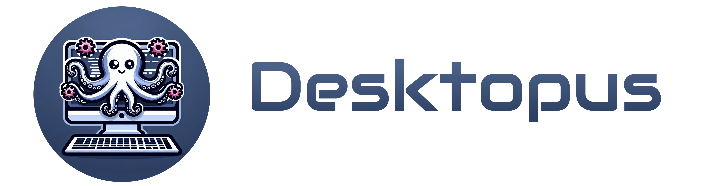

---

A suite of tools for running portable Linux desktops in containers.

### What is Desktopus?

- **Define and Deploy Anywhere:** Configure your Linux desktop as code and deploy it across various environments through containerization.
- **Multi-Desktop Support:** Seamlessly use multiple Linux desktops simultaneously, keeping your workflows organized and distinct.
- **Effortless Workspace Switching:** Quickly switch between different Linux workspaces without hassle.
- **Optimized Resource Utilization:** Run multiple Linux desktops concurrently, leveraging all available system resources.
- **Versatile Deployment:** Operate your Linux desktops locally, remotely, or on Kubernetes (k8s) using container technology.
- **Compatible with [Kasm Workspaces](https://kasmweb.com/)**

> [!NOTE]  
> This project is in development in early stages.
